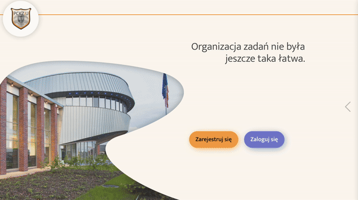

# TaskSync

Introducing TaskSync, a simple and intuitive platform tailored for small teams and projects. Register, create projects, and invite team members. Craft detailed plans, share files seamlessly, and engage in real-time communication through integrated chat. TaskSync is designed for streamlined collaboration, offering essential tools to help small teams work efficiently and achieve project success.

## 🚦 Project status

- [x] Live 🚀 
  
- [ ] Completed ✅
  
- [ ] Testing 🔎
  
- [ ] OnHold ⏸️
  
- [ ] In Development 🛠️
  
- [ ] Planned 📆

## 🖼️ Screenshots/Demo

## 💻 Usage

Project is available under this URL: *URl Comming Soon*

## 🌱 Contribution Guidelines

 - If you have suggestions to enhance the project, I welcome your ideas. Open a new issue or submit a pull request.
  
 - Found a bug ? Please create a new issue and share the details so that I can fix it as soon as possible.
  
## 📄 License

Information about **license** you can find in appropriate <u style="color: lightblue">[file](LICENSE)</u>.

## 🧑‍🎨 Author

Nikita Smolenskyi                  
smolenskyi.nikita@gmail.com